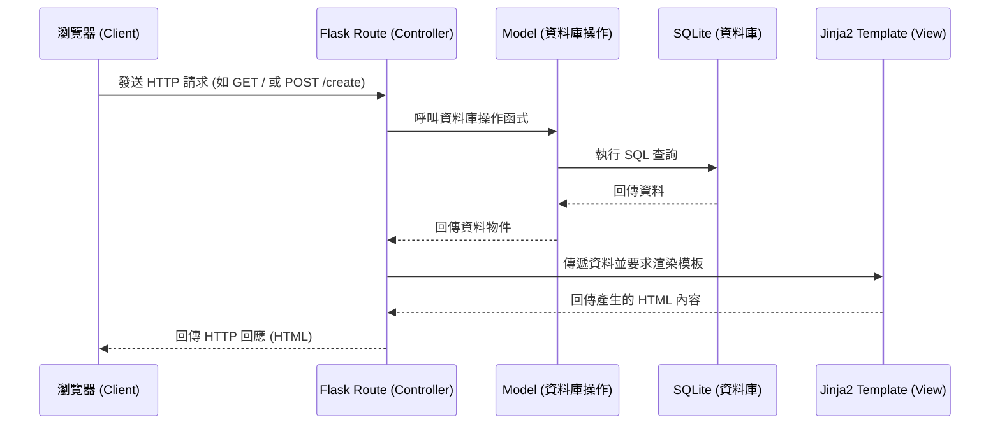

# 系統架構設計 — 讀書筆記本系統

## 1. 技術架構說明

本專案採用經典的伺服器端渲染（Server-Side Rendering, SSR）架構，以 Python 和 Flask 作為核心。我們選擇這種技術組合是因為其輕量、靈活，且非常適合快速開發與概念驗證。

**選用技術與原因：**
- **後端框架：Flask**。因為其輕巧且容易上手，沒有多餘的依賴，非常適合中小型專案。
- **模板引擎：Jinja2**。與 Flask 完美整合，讓我們能在 HTML 中輕鬆嵌入 Python 變數與邏輯，實現動態網頁渲染。
- **資料庫：SQLite**。無須額外架設資料庫伺服器，資料儲存為單一檔案，非常適合開發階段與這類小型的筆記系統。

**Flask MVC 模式說明：**
儘管 Flask 沒有強制規定 MVC 結構，但我們將依循此概念來組織程式碼：
- **Model（模型）**：負責定義資料結構（如：書籍、筆記、標籤）以及與 SQLite 資料庫的互動邏輯。
- **View（視圖）**：在此架構中，View 由 Jinja2 HTML 模板擔任，負責呈現使用者介面。
- **Controller（控制器）**：由 Flask 的路由（Routes）擔任，負責接收使用者的 HTTP 請求，調用對應的 Model 處理資料，最後將資料傳遞給 View 進行渲染。

## 2. 專案資料夾結構

為了保持程式碼的整潔與可維護性，我們採用以下資料夾結構：

```text
web_app_development2/
├── app.py                 ← 應用程式主入口，負責初始化 Flask app 與註冊路由
├── requirements.txt       ← Python 套件相依清單
├── app/                   ← 應用程式主要程式碼
│   ├── __init__.py        ← 標示為 Python 套件，並設定 app 工廠函式
│   ├── models/            ← 資料庫模型 (Model)
│   │   ├── __init__.py
│   │   └── note.py        ← 讀書筆記的資料表定義與操作
│   ├── routes/            ← 路由邏輯 (Controller)
│   │   ├── __init__.py
│   │   └── note_routes.py ← 處理筆記新增、修改、刪除、查詢的路由
│   ├── templates/         ← Jinja2 HTML 模板 (View)
│   │   ├── base.html      ← 共同的網頁佈局（Header, Footer 等）
│   │   ├── index.html     ← 首頁（筆記列表）
│   │   ├── create.html    ← 新增筆記表單頁面
│   │   ├── edit.html      ← 編輯筆記表單頁面
│   │   └── view.html      ← 單一筆記詳細頁面
│   └── static/            ← 靜態資源檔案
│       ├── css/
│       │   └── style.css  ← 網站共用樣式表
│       └── js/
│           └── main.js    ← 前端互動邏輯
└── instance/              ← 存放敏感資料或不該進入版本控制的檔案
    └── database.db        ← SQLite 資料庫檔案
```

## 3. 元件關係圖

以下圖示展示了當使用者在瀏覽器操作時，系統內部元件如何互動：



## 4. 關鍵設計決策

1. **採用單體式架構 (Monolithic Architecture) 而非前後端分離**
   - **原因**：專案為小型筆記系統，重點在於核心功能的實現。使用 Flask + Jinja2 可以在同一個專案中處理前後端邏輯，減少 API 設計的溝通成本，加快開發速度。
2. **路由與模型拆分 (Separation of Concerns)**
   - **原因**：避免將所有的邏輯都塞在單一 `app.py` 檔案中。透過 `app/routes/` 和 `app/models/` 資料夾的拆分，能讓程式碼更具可讀性，未來如果要擴展功能也更容易維護。
3. **使用 `instance/` 資料夾儲存資料庫檔案**
   - **原因**：資料庫檔案 (`database.db`) 包含了真實的運行資料，不應該被提交到版本控制中。將其放置於 Flask 預設的 `instance/` 資料夾並設定 Git 忽略，可以避免覆蓋其他開發者的本地資料。
4. **採用 Base Template 繼承機制**
   - **原因**：在 `templates/` 中建立 `base.html` 供其他頁面繼承，可以避免重複撰寫導覽列 (Navbar) 或頁尾 (Footer) 的 HTML 程式碼，確保全站設計風格一致且易於修改。
