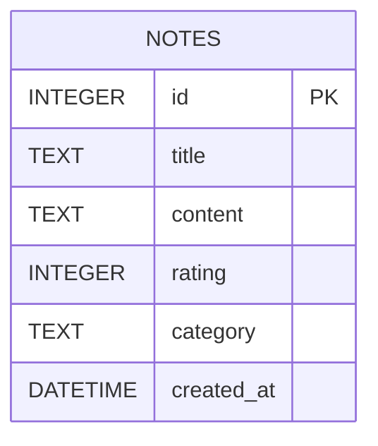

# 資料庫設計 — 讀書筆記本系統

## 1. ER 圖 (實體關係圖)

本系統目前為 MVP 階段，採用單一資料表架構，即可滿足主要的需求（包含書名、心得、評分與分類標籤）。



## 2. 資料表詳細說明

### `notes` (讀書筆記表)

負責儲存使用者的所有讀書筆記內容。

| 欄位名稱 | 型別 | 必填 | 說明 |
| --- | --- | --- | --- |
| `id` | INTEGER | 是 | Primary Key，自動遞增的唯一識別碼 |
| `title` | TEXT | 是 | 書籍名稱 |
| `content` | TEXT | 否 | 閱讀心得與筆記內容 |
| `rating` | INTEGER | 否 | 評分（例如：1 到 5 顆星） |
| `category` | TEXT | 否 | 分類或標籤（用字串儲存，如：文學、歷史） |
| `created_at` | DATETIME | 是 | 筆記建立時間，預設為 `CURRENT_TIMESTAMP` |

## 3. SQL 建表語法

完整的建表語法已儲存於 `database/schema.sql`，可直接匯入 SQLite 使用。

```sql
CREATE TABLE IF NOT EXISTS notes (
    id INTEGER PRIMARY KEY AUTOINCREMENT,
    title TEXT NOT NULL,
    content TEXT,
    rating INTEGER,
    category TEXT,
    created_at DATETIME DEFAULT CURRENT_TIMESTAMP
);
```

## 4. Python Model 程式碼

針對 `notes` 資料表的所有 CRUD 操作（新增、讀取、更新、刪除）以及搜尋功能，我們採用 Python 內建的 `sqlite3` 模組進行實作，以維持輕量與高效。程式碼已放置於 `app/models/note.py` 中。
