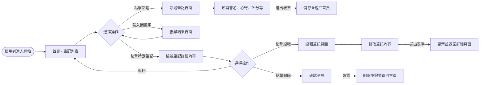
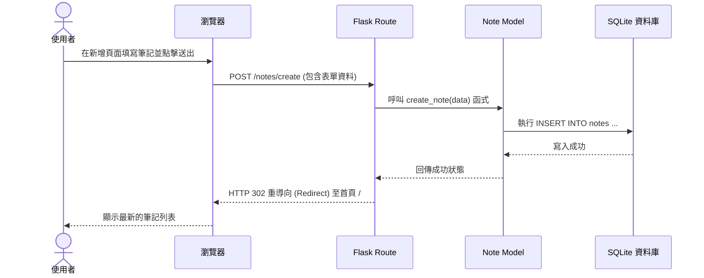

# 流程圖設計 — 讀書筆記本系統

## 1. 使用者流程圖 (User Flow)

此流程圖展示了使用者在網站上瀏覽與操作的路徑。

## 2. 系統序列圖 (Sequence Diagram)

此序列圖展示了以「新增讀書筆記」為例，系統前後端及資料庫的互動流程。

## 3. 功能清單對照表

以下為本系統的主要功能與其對應的 URL 路由設計規劃：

| 功能描述 | HTTP 方法 | URL 路徑 | 對應的 Jinja2 模板 | 備註 |
| --- | --- | --- | --- | --- |
| 瀏覽筆記列表 (首頁) | GET | `/` | `index.html` | 顯示所有筆記，支援列表呈現 |
| 搜尋筆記 | GET | `/search` | `index.html` | 透過 query parameter 傳遞關鍵字（例如：`?q=keyword`） |
| 顯示新增筆記表單 | GET | `/notes/create` | `create.html` | 提供使用者填寫的表單介面 |
| 處理新增筆記請求 | POST | `/notes/create` | 無 (重導向至 `/`) | 將表單資料存入資料庫 |
| 檢視單一筆記詳細內容 | GET | `/notes/<id>` | `view.html` | 顯示特定 ID 筆記的完整資訊 |
| 顯示編輯筆記表單 | GET | `/notes/<id>/edit` | `edit.html` | 載入舊有資料供修改 |
| 處理編輯筆記請求 | POST | `/notes/<id>/edit` | 無 (重導向至 `/notes/<id>`) | 更新資料庫中的該筆記內容 |
| 刪除筆記 | POST | `/notes/<id>/delete`| 無 (重導向至 `/`) | 執行刪除操作（為安全考量使用 POST） |
